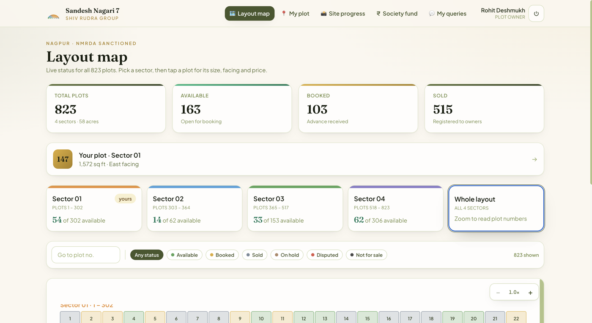
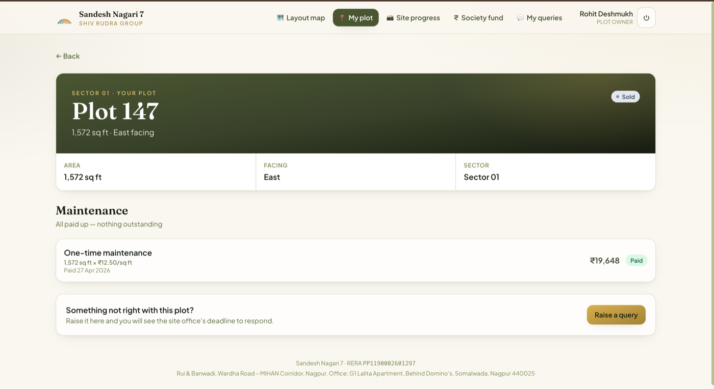
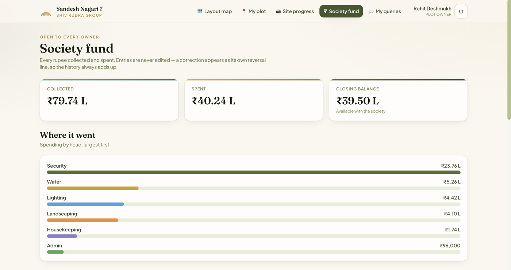
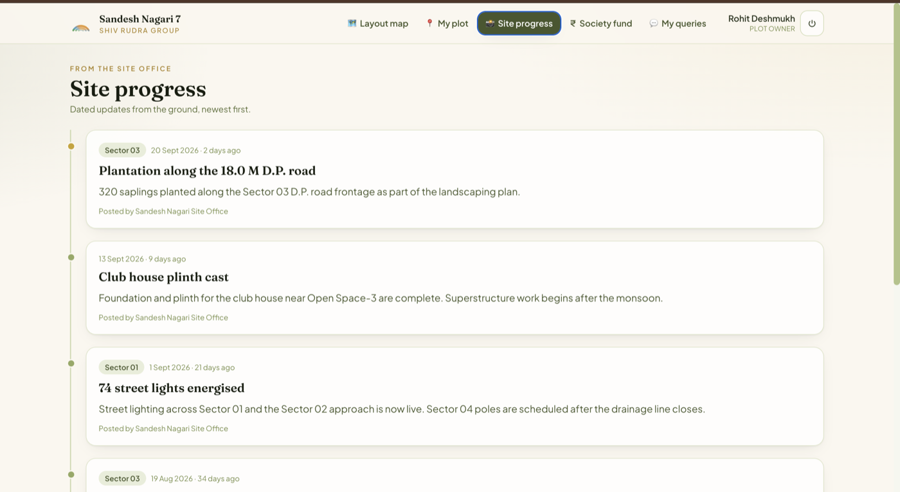
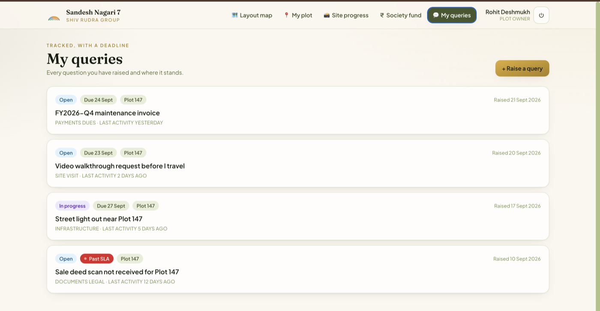
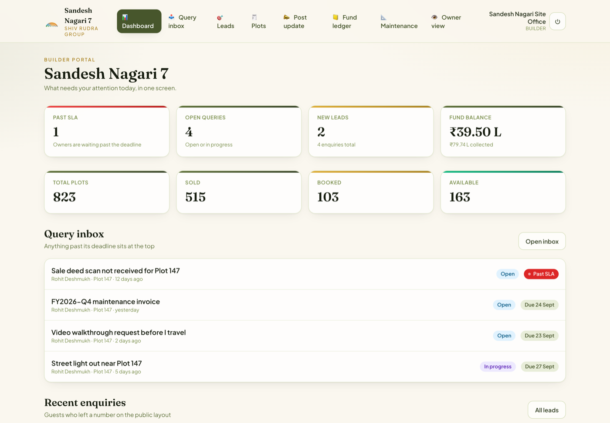
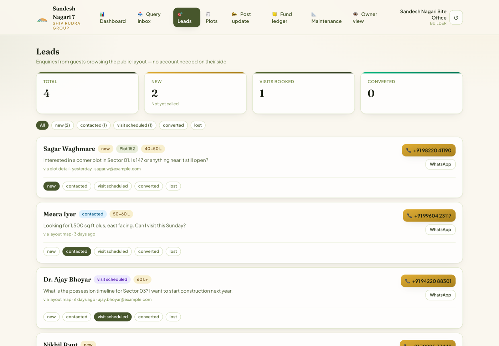

# Plotting Society

**Plot owners rarely live near the land they bought.** Every question — is my plot
still clear, where did the maintenance money go, when does the road get tarred —
becomes a phone call to the builder's sales desk. This replaces that desk.

Built against **Sandesh Nagari 7**: a real 823-plot, 58-acre NMRDA-sanctioned
project in Nagpur.

**[Live demo →](https://plotting-society.aniketcharjan3.workers.dev)**  ·  Go + Postgres + React  ·  runs at **₹0/month**

Sign in as `office@shivrudragroup.in` (builder) or `rohit.deshmukh@example.com`
(owner), password `sandesh-demo-2026` — or just browse `/explore`, no account needed.



---

## Three levels of access

| | Sees | Account |
|---|---|---|
| **Guest** | The layout, what's available and at what price, site progress — and can leave an enquiry | **None** |
| **Owner** | Their plot, dues, documents, the society ledger, their own query threads | Yes |
| **Builder** | All of it, plus the admin portal | Yes |

Every guest enquiry lands in the builder's leads board with the plot they were
looking at. That's the reason a builder shares the public link at all.

---

## Owner

| Their plot — the bill shows its working | Society fund — append-only |
|---|---|
|  |  |

| Site progress | Queries, with a visible SLA clock |
|---|---|
|  |  |

## Builder

| Dashboard | Leads from guests |
|---|---|
|  |  |

---

## Stack

Go 1.23 on the standard library router · Postgres 16 · React + TypeScript +
Tailwind · S3-compatible object storage.

**Four Go dependencies** — `pgx`, `golang-jwt`, `uuid`, `x/crypto`. SigV4 request
signing is ~100 lines against the stdlib rather than the AWS SDK.

**93.8% test coverage**, store and handler layers against a real Postgres — a
mock will happily agree a query filters by `builder_id` when it doesn't. They
caught a route conflict that would have stopped the server booting, and a
security pass caught a cross-builder data leak —
[both written up here](docs/ARCHITECTURE.md#what-the-tests-caught).

---

## Three decisions

**The fund ledger is append-only.** A correction writes a reversal row linked to
the original. When an owner disputes a figure, the builder shows the history
rather than a number that quietly changed.

**The layout map carries no owner details.** Names and numbers appear only on a
plot's own page, to that plot's owner and the builder.

**A bill snapshots what it was computed from** — rate, area, sector. Changing a
rate never re-prices an invoice already issued.

---

## Run it

```bash
make up && make seed && make run     # API on :8080
cd web && npm install && npm run dev # UI on :5173
```

`make seed` loads the full project and prints demo logins.

**[Architecture](docs/ARCHITECTURE.md)** — module pattern, and an honest list of
what will need work as this grows.
**[Deploy it free](docs/GO-LIVE.md)** — Supabase + Render + Cloudflare, no card.
