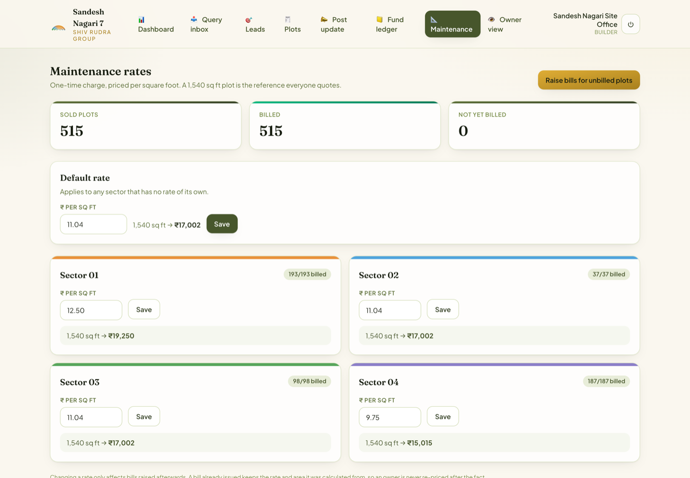
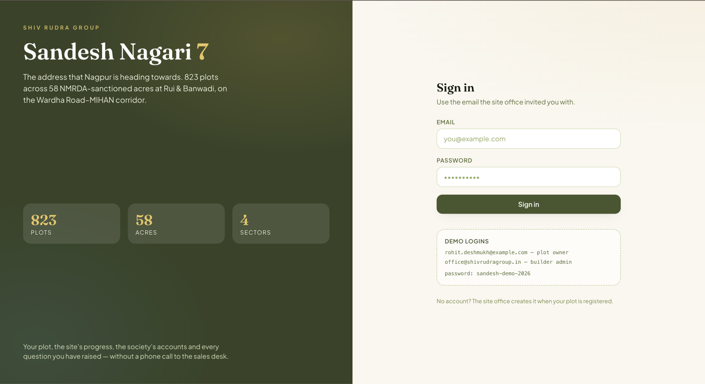

# Sandesh Nagari 7 — plot society portal

<p>
  
  
  
  
</p>

Most people who buy a plot never live near it. They buy in Nagpur and live in
Pune, Bengaluru or Dubai, and every question they have — is my plot still clear,
where did the maintenance money go, when does the road get tarred — becomes a
phone call to the builder's sales desk. That desk is the bottleneck, and it is
what this replaces.

Built against **Sandesh Nagari 7** by Shiv Rudra Group: 823 plots across 58
NMRDA-sanctioned acres at Rui &amp; Banwadi on the Wardha Road–MIHAN corridor,
Nagpur. Plot numbers, sector ranges, areas and the RERA number come from the
sanctioned layout; ownership, dues, ledger figures and queries are demo data.

---

<p align="center">
  <a href="https://plotting-society.aniketcharjan3.workers.dev"><b>Live demo</b></a> ·
  <a href="docs/GO-LIVE.md">Deploy it free</a> ·
  <a href="docs/ARCHITECTURE.md">Architecture</a>
</p>


---

## What an owner sees

The map is the centre of gravity: it is the one thing an owner 800 km away
cannot get today without phoning the sales desk. Pick a sector, then tap a plot.
Owner names and phone numbers are never on it.

Their own plot carries the working, not just a total — `1,572 sq ft × ₹12.50/sq ft`
— because a bare number invites the query that the page exists to prevent.

| Their plot | Site progress |
|---|---|
|  |  |

The society fund is open to every owner, with spending broken down by head. It
is append-only: a correction appears as its own reversal line, so a disputed
figure can be answered with the history rather than a number that quietly
changed.

Queries carry a **visible deadline**. That clock is the whole point — it is what
a WhatsApp group can never give you.

| Society fund | Queries, with the SLA clock |
|---|---|
|  |  |

---

## What the builder sees

One screen for what needs attention: anything past its deadline, open queries,
new leads, fund balance.


Every guest enquiry lands here with the plot they were looking at, their number,
and one tap to call or WhatsApp. That is the commercial reason for a builder to
share the public link at all.


Maintenance is a one-time charge priced per square foot, set **per sector**. The
reference quote updates as you type, because a slipped decimal point would bill
515 people the wrong amount.



---

## Signing in

Owners never self-register. The site office adds the plot, invites the owner,
and the invite binds that person to that plot on first sign-in.



---

## Three levels of access

| | Who | Sees | Signs in? |
|---|---|---|---|
| **Guest** | Anyone with the link | Layout map, what is available and at what price, amenities, recent site progress — and can leave an enquiry | **No account** |
| **Owner** | A registered plot owner | Everything a guest sees, plus their plot, dues, documents, the full society fund ledger, and their own query threads | Yes |
| **Builder** | Site office and staff | Everything, plus the admin portal: query inbox with SLA clocks, leads, plot status, progress posts, ledger entry | Yes |

A guest is not a user row. "Guest" is the absence of a token on a small set of
read-only routes plus one rate-limited write, the enquiry — which keeps
authorisation to three real states instead of a fourth identity to maintain.

Every guest enquiry lands in the builder's **Leads** board with the plot they
were looking at, their number, and a one-tap call and WhatsApp link. That is the
commercial reason for a builder to share the public link at all.

---

## What each side actually gets

**Owners**
- Live layout map of all 823 plots, colour-coded by sector and status
- Their plot: area, facing, corner, documents, maintenance dues and receipts
- Dated site-progress feed with photos
- The society fund ledger — collected, spent by head, closing balance
- Queries with a **visible SLA clock**, in eight categories

**Builders**
- One dashboard: what is past its deadline, what is open, new leads, fund balance
- Query inbox that sorts breached SLAs to the top, with internal notes owners cannot see
- Leads board with call / WhatsApp and a status pipeline
- Inline plot status editing across all 823 plots
- Post a progress update with photos, publish or save as a draft
- Add ledger entries; corrections are reversals, never edits

---

## Stack

| Layer | Choice | Why |
|---|---|---|
| API | Go 1.23, standard library router | One static binary, ~15 MB image, milliseconds per request |
| Database | Postgres 16 | Plots ↔ owners ↔ payments ↔ queries is relational |
| Object storage | S3-compatible — R2 in production, MinIO locally | Photos never touch the API or the database |
| Frontend | Vite + React 18 + TypeScript + Tailwind | |
| Auth | Argon2id + JWT access tokens + single-use refresh tokens | No third-party auth, no per-user cost |

Four direct Go dependencies: `pgx`, `golang-jwt`, `uuid`, `x/crypto`. S3 request
signing is written against the standard library rather than pulling in the AWS
SDK — about 100 lines, and it removes three dependencies.

**Cost to run: ₹0/month, with no credit card anywhere** — Supabase Postgres and
Storage, the Go binary on Render, the front end on Cloudflare Pages. Go is what
makes that fit: a 15 MB image that answers in single-digit milliseconds sits
inside free allowances that a Node or JVM service would spill out of.

**[`docs/GO-LIVE.md`](docs/GO-LIVE.md)** is the step-by-step for that stack.
[`docs/DEPLOY.md`](docs/DEPLOY.md) covers the faster Google Cloud Run path,
which wants a card on file even at ₹0, and what to move to once a builder
signs.

---

## Running it locally

Needs Docker and Go 1.23 (`brew install go`).

```bash
make up      # Postgres + MinIO
make seed    # Sandesh Nagari 7: 823 plots, ledger, progress posts, queries, leads
make run     # API on :8080

cd web && npm install && npm run dev   # UI on :5173
```

`make seed` prints the demo logins:

| Role | Email | Password |
|---|---|---|
| Builder admin | `office@shivrudragroup.in` | `sandesh-demo-2026` |
| Site staff | `sitedesk@shivrudragroup.in` | `sandesh-demo-2026` |
| Plot owner | `rohit.deshmukh@example.com` | `sandesh-demo-2026` |
| Guest | — no sign-in — | visit `/explore` |

Change that password before showing this to anyone outside your laptop.

---

## Layout

```
cmd/api/            server entry point
cmd/seed/           the Sandesh Nagari 7 layout, for a sales demo
internal/
  config/           env loading; fails at boot, never mid-request
  database/         pgx pool + embedded migrations
  httpx/            typed errors, JSON, middleware
  domain/           roles, plot statuses, the SLA table
  auth/             Argon2id, JWT, invites, role gates
  plot/             the layout map and plot detail
  query/            owner tickets, threads, SLA clocks
  fund/             append-only society ledger
  update/           construction progress feed
  media/            presigned uploads (SigV4, no SDK)
  lead/             guest access and enquiries
test/               schema smoke tests
web/                React app — owner views and the builder portal
```

**Adding a feature?** [`docs/ARCHITECTURE.md`](docs/ARCHITECTURE.md) has the
module pattern, the rules that are not negotiable, and an honest list of the
limits that will need work as this grows.

---

## Three decisions worth knowing about

**The fund ledger is append-only.** A correction writes a reversal row linked to
the original; nothing is updated or deleted. When an owner disputes a figure the
builder can show the whole history, rather than a number that quietly changed.
That is the difference between a ledger and a spreadsheet.

**The layout map carries no owner details.** Every signed-in owner sees which
plots are sold, available or on hold — that is the point of the map — but names
and numbers appear only on a plot's own detail page, to that plot's owner and to
the builder. An owner directory exists behind an explicit opt-in.

**Photos never pass through the API.** The browser gets a 15-minute presigned
URL and uploads straight to object storage. A scale-to-zero container cannot
afford to stream image bytes, and this is what keeps it inside a free CPU
allowance.

---

## Tests

```bash
make up            # the integration tests need a real Postgres
make test          # with Go installed
make test-docker   # without: runs the toolchain in a container
make cover         # coverage by package
make smoke         # schema and business-rule checks in SQL
```

| Package | Coverage | |
|---|---|---|
| `access` | **100.0%** | tenancy guard |
| `config` | **100.0%** | env loading |
| `domain` | **100.0%** | roles, statuses, SLA table |
| `httpx` | **100.0%** | errors, JSON, middleware |
| `media` | 98.4% | SigV4 signing, presigned uploads |
| `lead` | 96.3% | guest access and enquiries |
| `auth` | 94.6% | Argon2id, JWT, invites, sessions |
| `fund` | 93.8% | append-only ledger |
| `plot` | 93.6% | layout map, plot detail |
| `query` | 93.2% | tickets, threads, SLA clocks |
| `update` | 91.4% | progress feed |
| `database` | 78.0% | pool and migrations |
| **total** | **93.3%** | |

The store and handler layers are tested against a real Postgres rather than a
mock, because what they mostly contain is SQL — and a mock will happily agree
that a query filters by `builder_id` when it does not. Each package gets its own
database so the suite can run packages in parallel.

The remaining 6.7% is error handling that cannot be reached without injecting
faults below the driver: `crypto/rand` failing, HMAC signing failing, and
`rows.Scan` failing mid-stream after the query has already succeeded. Reaching
those would mean putting an interface in front of pgx's row iteration — real
structural cost for no runtime benefit. Everything reachable is covered,
including a "the database is down" path through every handler, which asserts the
API returns 500 rather than a silent empty success.

### What the tests caught

Two bugs found while writing them, both now fixed:

- **The server would not have started.** `GET /api/societies/by-slug/{slug}` and
  `GET /api/societies/{societyId}/plots` overlap, and Go's `ServeMux` *panics* at
  registration on an ambiguous pattern. The redundant route is gone.
- Renaming a plot onto a number that already exists returned a 500 where the
  create path correctly returned a 409.

Three security issues from a review pass, also fixed — see the tenancy guard in
`internal/access`, which every staff-only route now goes through.
